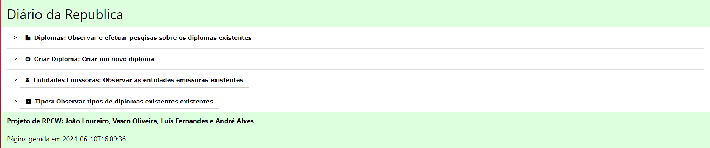
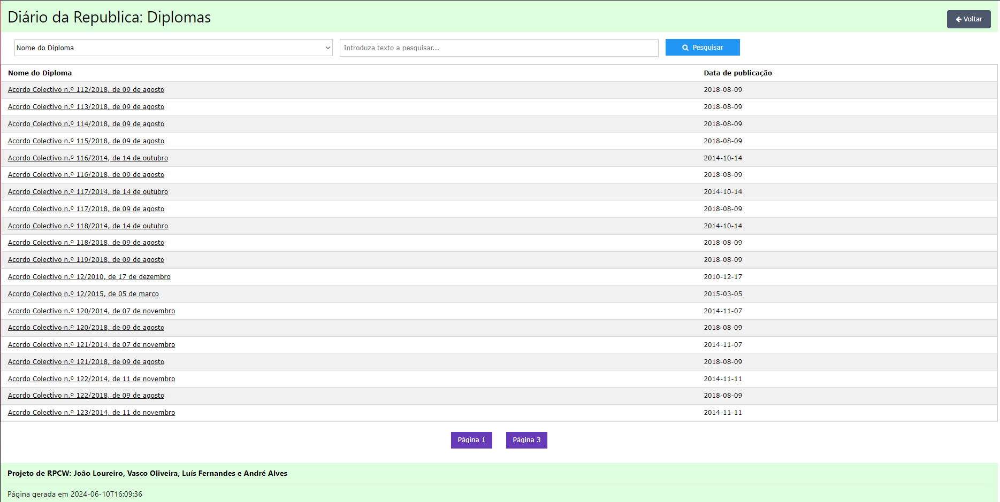
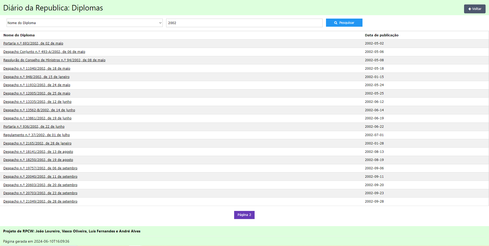
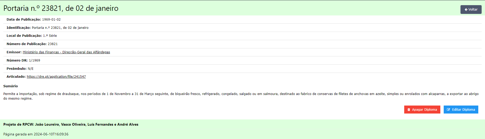
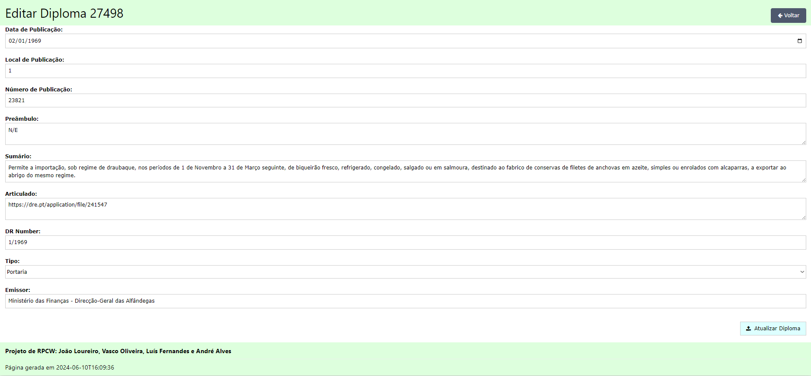
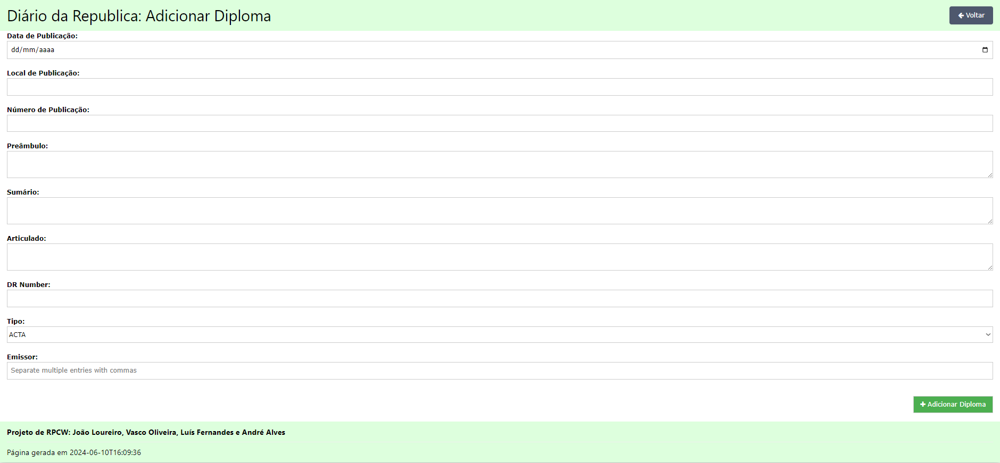
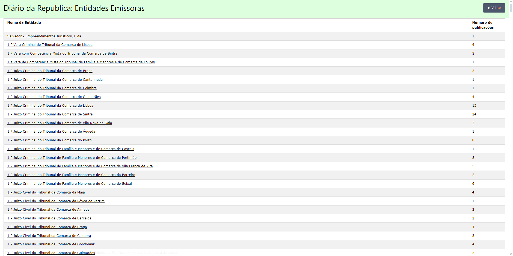
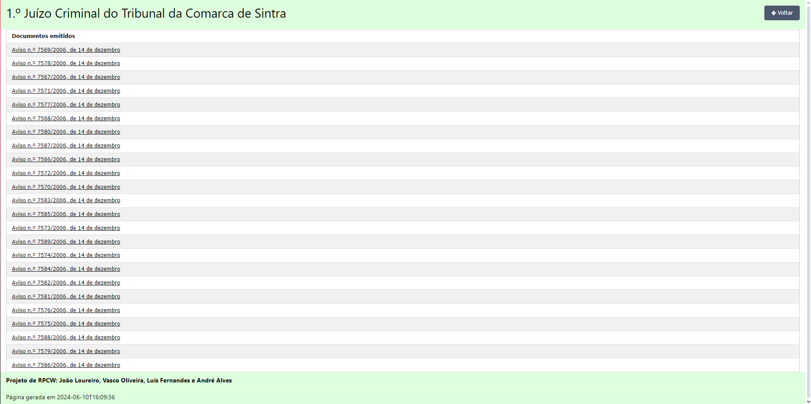
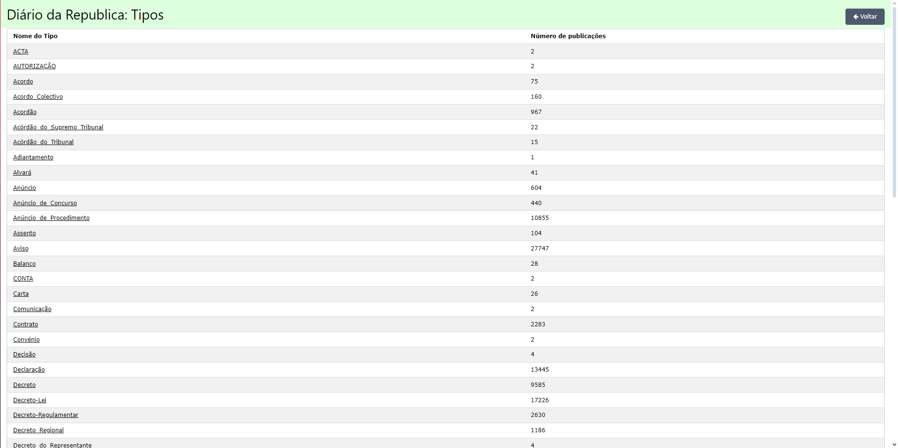
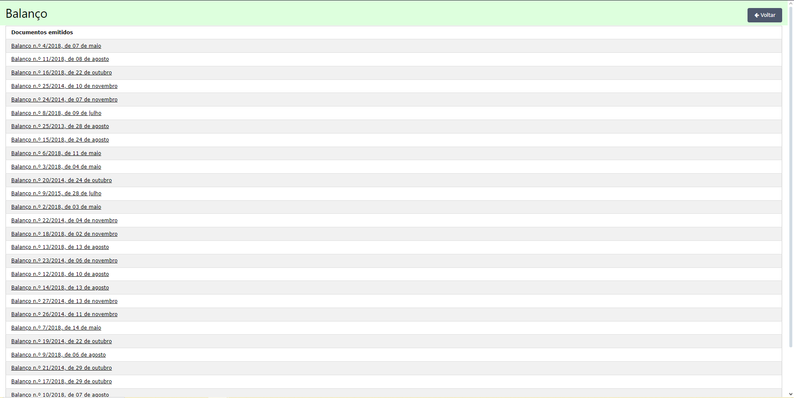

# RPCW 2024 - Projeto Final: Contrução e Exploração de uma Ontologia

- João Loureiro (pg53924)
- Vasco Oliveira (pg54269)
- Luís Fernandes (pg54019)
- André Alves (pg53651)

## Índice

- [RPCW 2024 - Projeto Final: Contrução e Exploração de uma Ontologia](#rpcw-2024---projeto-final-contrução-e-exploração-de-uma-ontologia)
  - [Índice](#índice)
  - [1. Introdução](#1-introdução)
  - [2. Dataset](#2-dataset)
  - [3. Ontologia](#3-ontologia)
    - [3.1. Classes](#31-classes)
    - [3.2. Atributos (Data Properties)](#32-atributos-data-properties)
      - [Diploma:](#diploma)
      - [Diario\_da\_Republica:](#diario_da_republica)
      - [Entidade\_Emissora:](#entidade_emissora)
    - [3.3. Relações (Object Properties)](#33-relações-object-properties)
  - [4. Web-App](#4-web-app)
    - [4.1. Backend/API](#41-backendapi)
    - [4.2. Frontend](#42-frontend)
  - [5. Setup para Correr](#5-setup-para-correr)
  - [6. Interface](#6-interface)
    - [Página Inicial](#página-inicial)
    - [Páginas dos Diplomas](#páginas-dos-diplomas)
    - [Páginas das Entidades Emissoras:](#páginas-das-entidades-emissoras)
    - [Páginas de Tipos:](#páginas-de-tipos)
  - [7. Conclusões e Trabalho Futuro](#7-conclusões-e-trabalho-futuro)

## 1. Introdução

Este repositório diz respeito ao desenvolvimento do projeto final da cadeira **Representação e Processamento de Conhecimento na Web** que consiste na criação e especificação de uma ontologia para representar um domínio de dados expresso num determinado dataset, bem como o desenvolvimento de uma web-app para a poder explorar e aumentar.

Para este trabalho decidimos seguir a **Proposta 2: Diário da República**, que consiste no tratamento e modelação de uma ontologia de vários diplomas publicados ao longo de vários anos pelo o Diário da República Portuguesa.

## 2. Dataset

Em termos de datasets, foram nos fornecidos 2: um ficheiro .sql (de 9.2GB) que contém informação resultante de um *dump* de uma base de dados SQL e o outro um ficheiro .json, de menor dimensão, que possui uma parte da informação presente no outro ficheiro.

Inicialmente, a intenção era utilizar ambos ficheiros de forma a maximizar a quantidade de dados presentes na ontologia, no entanto, ao tentar processar o ficheiro .sql, percebemos que devido à dimensão do ficheiro, ao utilizá-lo no *SQL Workbench* a aplicação não o aguentava, tornando impossivel o seu carregamento, dificultando o processo de efetuar *SQL queries* para obter os dados dentro do ficheiro. O mesmo acontece quando tentamos efetivamente abrir o ficheiro no *VSCode*, este também não conseguia aguentar com o ficheiro. Um outro problema relacionado com ele, foi o facto que dentro dele não existiam *SQL queries* de criação da base de dados nem da criação de tabelas que podessem facilitar o processo de relacionamento entre elas e identificação dos parâmetros definidos. Assim sendo, tendo em conta as inumeradas dificuldades anteriormente, optamos apenas por utilizar o .json.

> **Nota:** O dataset possui um tamanho demasiado elevado para incluir no repositório, pelo o que pode ser acedido e descarregado no seguinte link: [https://epl.di.uminho.pt/~jcr/AULAS/RPCW2024/projeto/](https://epl.di.uminho.pt/~jcr/AULAS/RPCW2024/projeto/) (ficheiro 2024-04-14-DRE_dump.json.bz2)

Após uma observação inicial dos dados para identificar alguns dos dados essenciais apresentados no documento que nos foi fornecido pelo o docente, criamos também algumas scripts auxiliares para ajudar no tratamento de dados para a ontologia (pasta [`data`](data)):

- [`data_publicacao.py`](data/data_publicacao.py), [`doc_type_sorter.py`](data/doc_type_sorter.py), [`ver_data.py`](data/ver_data.py): scripts auxiliares para poder observar os dados contidos nos fichieros .json, já que estes possuem um tamanho maior para observar diretamente.

- [`entidades.py`](data/entidades.py): percorre os dados e encontra todas as entidades emissoras de um diploma distintas.

- [`doc_class.py`](data/doc_class.py): percorre os dados e encontra todos os tipos/subclasses de diploma distintos. Ajudou na construção de um ficheiro [tipos.json](data/tipos.json) que associa um tipo a todas as diferentes formas que esta aparece escrita no dataset (ex: `Aviso` : {`AVISO`, `AVISO-EXTRATO`, `Aviso de Concurso`, `...`}) usado para uniformizar a identificação das classes.

- [`data_treatment.py`](data/data_treatment.py): utiliza o ficheiro [tipos.json](data/tipos.json) para uniformizar o campo `doc_type` para todas as ocorrências de um dado tipo nos dados presentes no dataset .json, imprimindo um novo ficheiro .json para ser utilizado ([new_data.json](new_data/tipos.json)).

- [`script.py`](data/script.py): utiliza o ficheiro [script.txt](data/script.txt) para criar subclasses para a ontologia criada. Estas novas classes são subclasses de Diploma.

## 3. Ontologia

Antes de especificar a ontologia, é necessário primeiro especificar o dóminio através da resposta às seguintes perguntas:

1. **Para que é que vamos usá-la?**

    A ontologia vai ser utilizada para manter informação sobre os vários diplomas publicados no Diário da República Portuguesa para ser explorada e manipulada através de uma interface web.

2. **A que perguntas deve dar resposta?**

    A qualquer pergunta que o utilizador tenha específica ao domínio, por exemplo: `Qual é a informação de um determinado diploma?`, `Quais foram os diplomas publicados num determinado número do Diário da República?` ou `Quais foram os diplomas publicados por uma determinada entidade?`, entre outros...

3. **Quem vai usá-la e mantê-la?**

    Num cenário real seriam as entidades governamentais responsáveis pela preservação e publicação do Diário da República, mas como encontramos-nos numa situação de avaliação formal será o grupo de trabalho.

Para criar a ontologia recorremos ao programa [`Protegé`](https://protege.stanford.edu), onde fizemos um ficheiro, [`diario_da_republica.ttl`](diario_da_republica.ttl), a utilizar como base para popular a ontologia.

Por sua vez, a script [`geraDiplomas.py`](geraDiplomas.py) popula a ontologia com recurso à biblioteca `rdflib`. No entanto, devido à enorme quantidade de dados existentes no .json, tivemos que fazer com que o programa guarde a ontologia em vários ficheiros `diario_da_republica_populatedX.ttl`, contendo cada um a informação a 100000 diplomas, todos associados ao URI `http://rpcw.di.uminho.pt/2024/diario-republica`.

> **Nota:** Neste repositório apenas estão incluidos os 2 primeiros ficheiros resultantes da execução da script já que não era possível incluir todas devido ao tamanho destes. A execução da script também demora algum tempo a ser concluida devido à enorme quantidade de dados a ser processada.

### 3.1. Classes

As classes classificam e representam os indivíduos que irão estar presentes num domínio, pelo que identificamos as seguintes classes após observar os dados fornecidos:

- **Diploma:** representa um diploma publicado numa determinada edição do Diário da República. Possui **várias subclasses**, uma por cada tipo distinto de tipo de diploma existente nos dados.
O id de cada diploma é o número pelo qual foi adicionado na ontologia (começando por 1).

- **Diario_da_Republica:** representa uma edição do Diário da República, lugar onde são públicados vários comunicados/informações relevantes ao país (diplomas).

- **Entidade_Emissora:** representa uma entidade emissora responsável por publicar um dado diploma num determinado Diário.

### 3.2. Atributos (Data Properties)

As propriedades de dados (data properties) descrevem atributos dos indivíduos, ligando-os a valores de dados literais. Para as classes identificadas, especificamos as seguintes propriedades:

#### Diploma:

- **numero_publicacao:** representa o número de publicação do diploma, ordenado conforme a ordem pela qual foi criado dentro do ano civil.

- **data_publicacao:** representa o dia em que o diploma foi publicado, usando a seguinte formatação: dia/mês/ano.

- **local_publicacao:** indica se o diploma se encontra na 1.ª ou 2.ª Série do diário da república a que pertence.

- **number:** representa o número da publicação do diploma e o ano civil a que foi criado, com o seguinte formato: (numero_publicacao)/ano.

- **identificacao_diploma:** fórmula utilizada para identificar os diplomas, usando a seguinte formatação: (subclasse do diploma) n.º (number), de (dia) de (mês).

- **articulado:** representa a parte dispositiva do diploma, artigos/normas legais.

- **sumario:** representa o sumário do diploma, contendo a indicação do assunto principal do diploma.

- **preambulo:** representa o enquadramento legal e justificativo do diploma, que normalmente termina com a indicação de que a entidade emissora “decreta o seguinte”.

- **doc_type:** representa o tipo ao qual estava definido no dataset original, usando o tipo.json para categorizá-lo na subclasse correta posteriormente.

Como o dataset .json fornecido ou contém o Sumário ou o Texto no parâmetro *notes* de cada diploma, nós consideramos que se esse parâmtero *note* conter a sub string "o seguinte:" quer dizer que é um
preâmbulo adicionando ao prêambulo a string toda de "o seguinte:" para trás, caso contrário é um sumário.

#### Diario_da_Republica:

- **dr_number:** representa o número do diário da república, também é usado para o id do diário.

#### Entidade_Emissora:

- **entidade_emissora:** representa o nome da entidade emissora, usado também para criar o id da entidade (removendo com a função *replace* todos os caracteres que não possam fazer parte de um id de um indivíduo).

### 3.3. Relações (Object Properties)

As propriedades de objeto (object properties) descrevem as relações entre indivíduos da ontologia. Identificamos as seguintes relações:

- **emite:** relação entre uma Entidade_Emissora e um Diploma, representa a ação de uma <u>entidade emissora</u> emitir um diploma.

- **emitido:** relação inversa da object propertie **emite**, representa a ação de um diploma ser <u>emitido</u> por uma entidade emissora.

- **publica:** relação entre um Diario_da_Republica e um Diploma, representa a ação de um diário da república <u>publicar</u> um diploma.

- **publicado:** relação inversa da object propertie **publica**, representa a ação de um diploma ser <u>publicado</u> por um diário da república.

## 4. Web-App

### 4.1. Backend/API

Nesta seção, apresentamos a implementação da API, construída para interagir com a base de dados que armazena a Ontologia do Diário da República.
A API foi desenvolvida em Python, utilizando o framework Flask e a biblioteca SPARQLWrapper para consulta e atualização da base de dados.

A API consiste em várias rotas para realizar operações CRUD (Create, Read, Update, Delete) na Ontologia. Aqui estão as principais funcionalidades da API:

- **Listar todos os diplomas:** permite listar todos os diplomas armazenados na base de dados. Suporta paginação para facilitar a navegação pelos resultados.

- **Buscar diplomas por critérios específicos:** permite realizar uma busca flexível por diplomas com base nas diferentes data properties como identificação, data de publicação, local de publicação, entre outros.

- **Obter informações de um diploma específico:** permite obter informações detalhadas sobre um diploma específico, incluindo a sua identificação, data de publicação, emissores, tipo, entre outros.

- **Listar todas as entidades emissoras:** permite listar todas as entidades emissoras de diplomas registadas na Ontologia.

- **Criar um novo diploma:** permite criar um novo diploma adicionando-o na Ontologia, fornecendo os dados necessários, como data de publicação, local de publicação, emissores, entre outros. 
Ao criar um diploma os emissores e o diário da república que não existerem na base dados também são criados.

- **Atualizar um diploma existente:** permite atualizar os dados de um diploma existente com base no seu ID, fornecendo os novos dados a serem atualizados. 
As ligações (object properties) anteriores entre os emissores e o diário da república com o diploma serão eliminadas da ontologia caso seja pedido alteração das mesmas.

- **Eliminar um diploma:** permite excluir um diploma existente na Ontologia, com base no seu ID.

### 4.2. Frontend

A Frontend é responsável por fornecer a interface para os usuários interagirem com os dados do Diário da República. 
Ele utiliza o framework Flask para renderizar as páginas HTML e enviar requisições HTTP para a API demonstrada na secção anterior.

Cada página do frontend interage com a API por meio de requisições HTTP para obter, adicionar, alterar ou apagar os dados necessários. 
As respostas da API são então renderizadas nas páginas HTML para exibição aos usuários.

A frontend consiste destas páginas seguintes:

- **Página inicial (/):** Esta página é o ponto de entrada da aplicação, dando a opção de ver as restantes páginas (lista de diplomas, form para criar um diploma, lista de entidades emissoras, lista de diferentes tipos)

- **Página de Entidades (/entidades):** Exibe a lista de todas as entidades emissoras.

- **Página de uma Entidade (/entidades/$\lt$name>):** Lista todos os diplomas que foram emitidos por uma entidade emissora específica.

- **Página de Tipos (/tipos):** Exibe uma lista de todos os tipos de diplomas existentes.

- **Página de um Tipo (/tipos/$\lt$tipo$\gt):** Lista todos os diplomas que sejam desse específico tipo.

- **Página de Diplomas (/diplomas):** Exibe uma lista paginada (20 diplomas por página) de todos os diplomas disponíveis, com opções de pesquisa e filtragem, tendo que fornecer que atributo do diploma 
se quer pesquisar (através de um dropdown) e o texto que pretende pesquisar (search bar).

- **Página de um Diploma (/diplomas/$\lt$id$\gt):** Mostra informações detalhadas sobre um diploma específico, com todos os seus atributos e ligações com outras entidades.
Também contém um botão "Editar" que redereciona o usuário para o form de edição desse diploma.

- **Página de Criação de Diploma (/diplomas/form):** Permite ao usuário criar um novo diploma preenchendo um formulário com os dados necessários.

- **Página de Edição de Diploma (/diplomas/edit/$\lt$id$\gt):** Permite ao usuário editar um diploma existente preenchendo um formulário com os dados pretendidos a atualizadar.

Todas estas páginas contém um botão "Voltar" que leva o usuário para a Páginal inicial (/).

## 5. Setup para Correr

Antes de iniciar a aplicação, é necessário configurar o ambiente corretamente. 

Para popular a ontologia consoante os dados fornecidos é necessário primeiro correr a script [`geraDiplomas.py`](app/geraDiplomas.py), que vai criar 22 ontologias distintas dentro da pasta "ontologias".

Para dar setup à base de dados é necessário iniciar a aplicação GraphDB na porta 7000, depois cria-se um novo repositório com o nome "diarioRepublica",
e por fim adiciona-se as ontologias, encontradas na pasta "ontologias", nesse repositório.

Para dar setup à API é só correr a script [`api.py`](api.py) e para dar setup à frontend é só iniciar a script [`app.py`](app/app.py), abrindo a aplicação no link fornceido no terminal.

## 6. Interface

Nesta secção vamos mostrar alguns prints da interface da nossa aplicação. Mantenha o rato em cima de cada imagem para ver o seu título.

### Página Inicial:

### Páginas dos Diplomas:

### Páginas das Entidades Emissoras:

### Páginas de Tipos:

## 7. Conclusões e Trabalho Futuro

Com o desenvolvimento deste projeto, conseguimos aprofundar não só o nosso conhecimento obtido nas aulas de Representação e Processamento de Conhecimento na Web,
mas também o nosso entendimento sobre o Diário da República.

Para trabalho futuro, gostaríamos de melhorar a nossa interface. Chegamos a tentar usar React, mas tivemos alguns problemas e acabamos por desistir da ideia. 
Além disso, gostaríamos de explorar o dataset SQL fornecido, tendo mais tempo para compreendê-lo e integrá-lo adequadamente.

Acreditamos que entregamos um bom trabalho, que atendeu aos requisitos do projeto. 
No entanto, com mais tempo, poderíamos refinar a interface, adicionar mais funcionalidades e explorar plenamente os dados disponíveis.